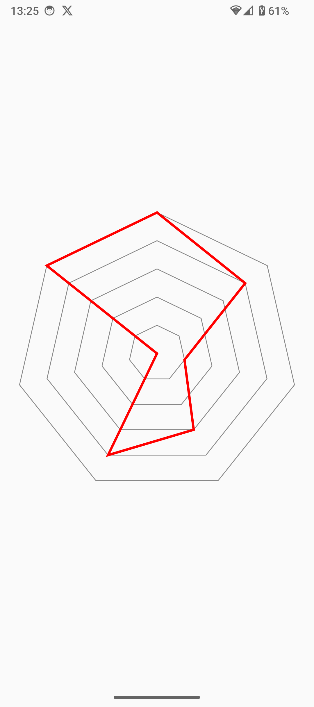
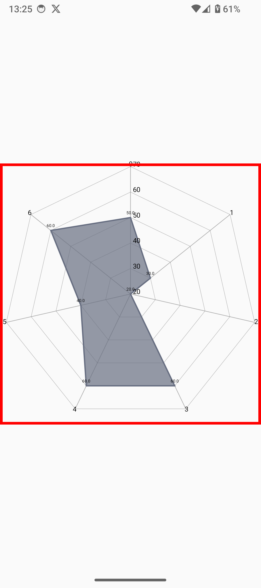
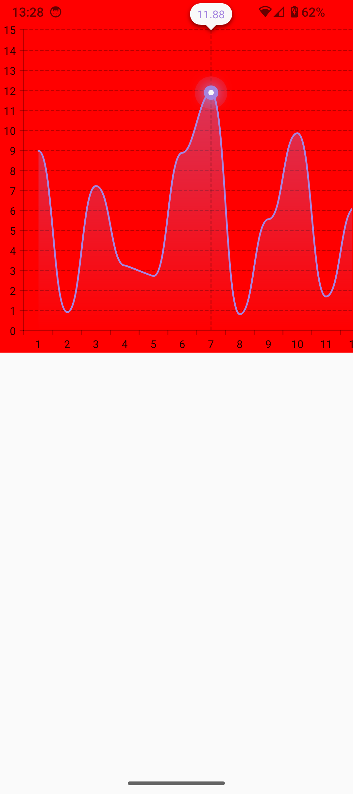

# Android Graph Practice

レーダーチャートの描画を題材に 3 つのライブラリをお試ししてみました。

- vico ... レーダーチャート非対応だった...
- mp-android-chart
- Canvas を使って自前で実装

| ライブラリ/実装方法           |                                                                            | スクショ                                                                        |
| ----------------------------- | -------------------------------------------------------------------------- | ------------------------------------------------------------------------------- |
| Canvas を使ってフルスクラッチ | 自由度こそ高いが、レイアウト計算大変だよ。ラベルもつけたいとなると結構辛い |          |
| mp android chart              | 手軽だが Compose と一緒に使おうとするとちょっと使いづらい...               |  |
| vico                          | そもそもレーダチャートに対応していない...                                  |                          |

## memo

- vico はレーダチャートに対応してなかった... 🥲
- レーダーチャートのデータの個数が奇数個だと、レイアウト計算の都合上指定した領域いっぱいに描画することができず少し下に余白ができてしまう
  - フルスクラッチ・mp android chart どちらも
